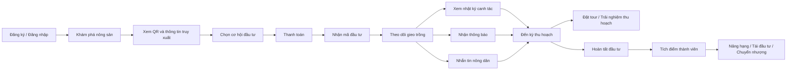

# Phân tích hệ thống Fruitlink

## 1. Bối cảnh hệ thống

Fruitlink là một nền tảng kết nối **nông dân – nhà đầu tư – người tiêu dùng/trải nghiệm du lịch nông nghiệp** trong cùng một hệ sinh thái. Qua các tài liệu đã gửi, hệ thống được xây dựng để giải quyết bài toán nông sản bị phụ thuộc trung gian, khó truy xuất nguồn gốc, thiếu vốn đầu tư ban đầu và thiếu cơ chế theo dõi minh bạch trong suốt chu kỳ canh tác.

Bối cảnh vận hành của hệ thống gồm các điểm chính:

- **Nông dân** có nhu cầu đầu ra ổn định, được hỗ trợ vốn và được số hóa quá trình canh tác.
- **Nhà đầu tư** muốn tìm nguồn nông sản chất lượng, có thể theo dõi tiến độ minh bạch và tham gia trải nghiệm thu hoạch.
- **Hệ thống Fruitlink** đóng vai trò nền tảng trung gian công nghệ, quản lý luồng đầu tư, theo dõi canh tác, truy xuất nguồn gốc và tích lũy quyền lợi thành viên.
- **Nền tảng hAgri** là lớp công nghệ hỗ trợ cho Fruitlink, giúp số hóa nhật ký canh tác, QR truy xuất, giám sát nông nghiệp và xây dựng thương hiệu nông sản.

Nói ngắn gọn, đây không chỉ là một ứng dụng mua bán nông sản, mà là **hệ thống đầu tư – theo dõi – thu hoạch – trải nghiệm – tái đầu tư nông sản số**.

---

## 2. Mô tả bài toán

### 2.1. Vấn đề thực tế

Từ nội dung trong tài liệu, bài toán xuất phát từ các khó khăn sau:

- Nông dân **mất kết nối trực tiếp với người tiêu dùng/nhà đầu tư**.
- Nông sản đi qua nhiều khâu trung gian nên **bị ép giá**.
- Người mua/nhà đầu tư **khó kiểm chứng nguồn gốc và chất lượng**.
- Nông dân thiếu vốn ban đầu cho một mùa vụ mới.
- Quá trình canh tác và thu hoạch chưa được theo dõi minh bạch, gây thiếu niềm tin.
- Giá trị nông sản chưa được mở rộng thành dịch vụ trải nghiệm, du lịch nông nghiệp hay hệ sinh thái thành viên.

### 2.2. Bài toán hệ thống cần giải quyết

Hệ thống cần tạo ra một nền tảng cho phép:

1. Người dùng đăng ký, xác thực và tham gia hệ sinh thái.
2. Người dùng khám phá các sản phẩm/dự án nông sản đang mở đầu tư.
3. Nhà đầu tư rót vốn cho một mùa vụ cụ thể.
4. Nông dân dùng vốn để canh tác và cập nhật tiến độ.
5. Hệ thống cung cấp nhật ký số, thông báo, truy xuất QR và cơ chế nhắn tin.
6. Đến kỳ thu hoạch, nhà đầu tư được nhận sản phẩm/quyền lợi hoặc tham gia tour trải nghiệm.
7. Người dùng tiếp tục tích lũy điểm, nâng hạng, tái đầu tư hoặc chuyển nhượng quyền đầu tư.

### 2.3. Mục tiêu hệ thống

- Kết nối trực tiếp nông dân và nhà đầu tư/người tiêu dùng.
- Tạo **chu kỳ đầu tư nông sản minh bạch** từ đầu tư đến thu hoạch.
- Tăng niềm tin bằng **truy xuất nguồn gốc và nhật ký canh tác số**.
- Giúp nông dân có vốn, đầu ra và công cụ quản lý mùa vụ.
- Mở rộng giá trị nông nghiệp sang **du lịch trải nghiệm và chương trình thành viên**.

---

## 3. Các tác nhân chính của hệ thống

### 3.1. Người dùng / Nhà đầu tư
Là người đăng ký tài khoản, tìm hiểu dự án nông sản, đầu tư vốn, theo dõi mùa vụ, nhận thông báo, tham gia thu hoạch hoặc đặt tour trải nghiệm.

### 3.2. Nông dân
Là bên tiếp nhận nguồn vốn, thực hiện canh tác, cập nhật nhật ký kỹ thuật, đảm bảo chất lượng và phối hợp với hệ thống trong quá trình thu hoạch.

### 3.3. Hệ thống Fruitlink
Điều phối luồng thông tin, đầu tư, thanh toán, mã đầu tư, thông báo, quyền lợi và tương tác giữa các bên.

### 3.4. Nền tảng công nghệ hAgri
Hỗ trợ các năng lực lõi như:

- Nhật ký canh tác kỹ thuật số
- Truy xuất nguồn gốc toàn diện bằng QR
- Số hóa nông nghiệp địa phương
- Giám sát nông nghiệp và hỗ trợ khoa học công nghệ
- Xây dựng thương hiệu nông sản

### 3.5. Quản trị viên (suy ra từ nghiệp vụ)
Dù tài liệu người dùng không mô tả trực tiếp, nhưng về mặt phân tích hệ thống cần có vai trò quản trị để:

- Quản lý tài khoản và xác thực
- Quản lý danh mục nông sản/dự án đầu tư
- Theo dõi trạng thái mùa vụ
- Quản lý thanh toán, mã đầu tư, quyền lợi và lịch tour
- Xử lý khiếu nại, hỗ trợ và kiểm duyệt nội dung

---

## 4. Chức năng chính của hệ thống

## 4.1. Nhóm chức năng tài khoản

- Đăng ký tài khoản
- Đăng nhập
- Xác thực OTP
- Quản lý hồ sơ người dùng

## 4.2. Nhóm chức năng khám phá nông sản

- Xem danh sách nông sản/dự án đang mở
- Chọn nông sản muốn đầu tư
- Xem thông tin chi tiết nông sản
- Xem QR và thông tin truy xuất nguồn gốc
- Xem thông tin canh tác, vùng trồng, quy trình

## 4.3. Nhóm chức năng đầu tư nông sản

- Chọn gói hoặc cơ hội đầu tư
- Đầu tư vốn ban đầu
- Thanh toán
- Nhận mã đầu tư
- Xác nhận giao dịch đầu tư thành công

## 4.4. Nhóm chức năng theo dõi gieo trồng

- Xem nhật ký canh tác
- Nhận thông báo tiến độ
- Theo dõi tình trạng mùa vụ
- Nhắn tin với nông dân hoặc bộ phận hỗ trợ
- Theo dõi chất lượng và các cập nhật trong quá trình trồng

## 4.5. Nhóm chức năng thu hoạch và trải nghiệm

- Theo dõi thời điểm thu hoạch
- Đặt tour về vườn
- Trải nghiệm thu hoạch thực tế
- Hoàn tất chu kỳ đầu tư
- Nhận nông sản/quyền lợi sau đầu tư

## 4.6. Nhóm chức năng tích lũy và quyền lợi

- Tích điểm thành viên
- Nâng hạng đầu tư
- Tái đầu tư
- Chuyển nhượng quyền đầu tư
- Quản lý ưu đãi/hạng thành viên

## 4.7. Nhóm chức năng công nghệ hỗ trợ

- Nhật ký canh tác số
- Truy xuất QR toàn diện
- Giám sát nông nghiệp bằng dữ liệu số
- Hỗ trợ khoa học công nghệ trong canh tác
- Xây dựng thương hiệu nông sản địa phương

---

## 5. Luồng nghiệp vụ tổng thể

Dựa trên hai tài liệu, có thể gom thành luồng tổng thể như sau:

1. **Người dùng tạo tài khoản / đăng nhập** để tham gia hệ thống.
2. **Người dùng khám phá nông sản** và xem thông tin nguồn gốc, chất lượng, cơ hội đầu tư.
3. **Người dùng quyết định đầu tư**, thực hiện thanh toán và nhận mã đầu tư.
4. **Nông dân tiếp nhận vốn**, bắt đầu triển khai canh tác.
5. **Hệ thống số hóa quá trình sản xuất** qua nhật ký canh tác, QR truy xuất, thông báo tiến độ.
6. **Nhà đầu tư theo dõi mùa vụ** qua nhật ký, thông báo và nhắn tin.
7. **Đến kỳ thu hoạch**, nhà đầu tư có thể nhận sản phẩm, tham gia trải nghiệm hoặc đặt tour về vườn.
8. **Chu kỳ đầu tư hoàn tất**, người dùng được cộng điểm, nâng hạng, tái đầu tư hoặc chuyển nhượng.

---

## 6. Luồng theo từng vai trò

## 6.1. Luồng của nhà đầu tư/người dùng

- Đăng ký/đăng nhập
- Xác thực OTP
- Khám phá nông sản
- Xem QR, nguồn gốc, thông tin canh tác
- Chọn cơ hội đầu tư
- Thanh toán
- Nhận mã đầu tư
- Theo dõi nhật ký gieo trồng
- Nhận thông báo và tương tác
- Tham gia thu hoạch / đặt tour
- Hoàn tất đầu tư
- Tích điểm, nâng hạng, tái đầu tư

## 6.2. Luồng của nông dân

- Tham gia hệ sinh thái sản xuất
- Nhận vốn đầu tư ban đầu
- Triển khai canh tác
- Cập nhật nhật ký kỹ thuật số
- Cung cấp thông tin truy xuất nguồn gốc
- Tương tác với nhà đầu tư qua hệ thống
- Thực hiện thu hoạch
- Hoàn tất phân phối nông sản/quyền lợi

## 6.3. Luồng của hệ thống

- Quản lý tài khoản và OTP
- Quản lý danh mục nông sản
- Ghi nhận giao dịch đầu tư và thanh toán
- Sinh mã đầu tư
- Thu thập và hiển thị nhật ký canh tác
- Gửi thông báo tiến độ
- Quản lý tương tác nhắn tin
- Quản lý tour/trải nghiệm thu hoạch
- Tính điểm thành viên và hạng đầu tư
- Hỗ trợ tái đầu tư/chuyển nhượng

---

## 7. Mô hình nghiệp vụ cốt lõi

Tài liệu cho thấy mô hình cốt lõi của Fruitlink là chu kỳ 3 bước:

### Bước 1: Đầu tư
Nhà đầu tư cung cấp vốn ban đầu cho nông dân.

### Bước 2: Canh tác
Nông dân sử dụng vốn để chăm sóc cây trồng, đảm bảo chất lượng.

### Bước 3: Thu hoạch
Nhà đầu tư thanh toán phần còn lại và nhận nông sản hoặc quyền lợi liên quan.

Từ góc nhìn phân tích hệ thống, chu kỳ 3 bước này là **xương sống nghiệp vụ** của toàn bộ nền tảng.

---

## 8. Lợi ích nghiệp vụ của hệ thống

### Đối với nông dân

- Có đầu ra đảm bảo
- Không bị ép giá
- Có vốn trả trước
- Được số hóa quá trình canh tác

### Đối với nhà đầu tư

- Có nguồn cung chất lượng
- Nguồn gốc rõ ràng
- Có thể giám sát trực tuyến
- Có trải nghiệm thu hoạch thực tế

---

## 9. Các phân hệ nên có khi phân tích hệ thống

Nếu viết theo hướng phân tích thiết kế hệ thống, có thể tách thành các phân hệ sau:

1. **Phân hệ quản lý người dùng**
   - Đăng ký, đăng nhập, OTP, hồ sơ

2. **Phân hệ quản lý nông sản/dự án đầu tư**
   - Danh mục nông sản, chi tiết dự án, trạng thái mở đầu tư

3. **Phân hệ đầu tư và thanh toán**
   - Tạo giao dịch, thanh toán, cấp mã đầu tư, theo dõi trạng thái

4. **Phân hệ theo dõi canh tác**
   - Nhật ký canh tác, thông báo tiến độ, tương tác với nông dân

5. **Phân hệ truy xuất nguồn gốc**
   - Mã QR, thông tin vùng trồng, lịch sử canh tác, minh bạch dữ liệu

6. **Phân hệ thu hoạch và trải nghiệm**
   - Lịch thu hoạch, đặt tour, hoàn tất nhận sản phẩm/quyền lợi

7. **Phân hệ thành viên và quyền lợi**
   - Tích điểm, xếp hạng, tái đầu tư, chuyển nhượng

8. **Phân hệ quản trị hệ thống**
   - Quản trị người dùng, nông sản, mùa vụ, giao dịch, quyền lợi, báo cáo

---

## 10. Biểu diễn luồng tổng quát

---

## 11. Mô tả bài toán theo văn phong báo cáo

Fruitlink là hệ thống hỗ trợ kết nối trực tiếp giữa nông dân và nhà đầu tư thông qua mô hình đầu tư nông sản số. Hệ thống cho phép người dùng đăng ký tài khoản, khám phá các nông sản đang mở đầu tư, thực hiện thanh toán để tham gia đầu tư và theo dõi toàn bộ quá trình gieo trồng thông qua nhật ký canh tác, thông báo tiến độ và truy xuất nguồn gốc bằng mã QR. Khi đến giai đoạn thu hoạch, người dùng có thể nhận nông sản, tham gia trải nghiệm thực tế tại vườn và tiếp tục tái đầu tư trong các chu kỳ sau. Thông qua nền tảng này, hệ thống giải quyết đồng thời bài toán thiếu vốn của nông dân, thiếu minh bạch nguồn gốc nông sản và thiếu cơ chế kết nối trực tiếp giữa người sản xuất với người đầu tư.

---

## 12. Kết luận ngắn

Fruitlink là một hệ thống có bản chất là **nền tảng đầu tư nông sản kết hợp quản lý chu kỳ canh tác và truy xuất minh bạch**. Điểm đặc trưng của hệ thống không nằm ở bán hàng đơn thuần, mà nằm ở việc liên kết nhiều luồng nghiệp vụ trong một vòng đời khép kín:

- Khám phá nông sản
- Đầu tư
- Theo dõi canh tác
- Thu hoạch / trải nghiệm
- Tích lũy quyền lợi
- Tái đầu tư

Đây là điểm nên nhấn mạnh khi làm phần **bối cảnh hệ thống**, **mô tả bài toán** và **chức năng chính** trong báo cáo phân tích hệ thống.

